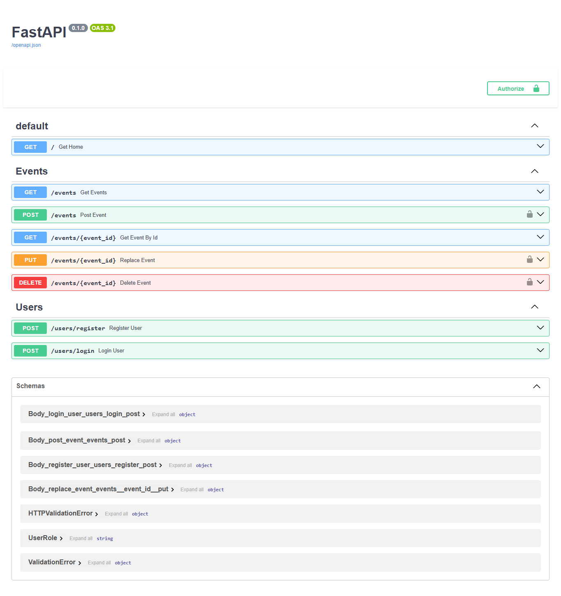

# Event Management API

This is a robust and scalable event management API built with FastAPI, designed to streamline the process of organizing and managing college events. It provides a comprehensive set of features for user authentication, event creation, and management, making it an ideal solution for college event organizers.



## Features

- **User Authentication**: Secure user registration and login functionality to ensure that only authorized users can access the API.
- **Event Management**: A complete set of CRUD (Create, Read, Update, Delete) operations for managing events, allowing for easy creation, retrieval, and modification of event details.
- **Scalable Architecture**: Built with FastAPI, the API is designed to be highly performant and scalable, capable of handling a large number of requests.

## Getting Started

These instructions will get you a copy of the project up and running on your local machine for development and testing purposes.

### Prerequisites

- Python 3.8+
- MongoDB account
- Cloudinary account

### Installation

1. **Clone the repository**:
   ```sh
   git clone https://github.com/your-username/event-management-api.git
   cd event-management-api
   ```

2. **Create a virtual environment**:
   ```sh
   python -m venv venv
   source venv/bin/activate
   ```

3. **Install the dependencies**:
   ```sh
   pip install -r requirements.txt
   ```

4. **Set up the environment variables**:
   Create a `.env` file in the root directory and add the following variables:
   ```env
   MONGO_URI="your-mongodb-uri"
   CLOUDINARY_CLOUD_NAME="your-cloudinary-cloud-name"
   CLOUDINARY_API_KEY="your-cloudinary-api-key"
   CLOUDINARY_API_SECRET="your-cloudinary-api-secret"
   JWT_SECRET_KEY="your-jwt-secret-key"
   ```

5. **Run the application**:
   ```sh
   uvicorn main:app --reload
   ```

## API Endpoints

The API provides a range of endpoints for managing users and events. Here is a summary of the available endpoints:

### Users

- `POST /users/register`: Register a new user.
- `POST /users/login`: Log in an existing user.

### Events

- `GET /events`: Retrieve a list of all events.
- `POST /events`: Create a new event.
- `GET /events/{event_id}`: Retrieve a specific event by its ID.
- `PUT /events/{event_id}`: Update an existing event.
- `DELETE /events/{event_id}`: Delete an event.

## Contributing

Contributions are welcome! Please feel free to submit a pull request or open an issue to discuss any changes.
